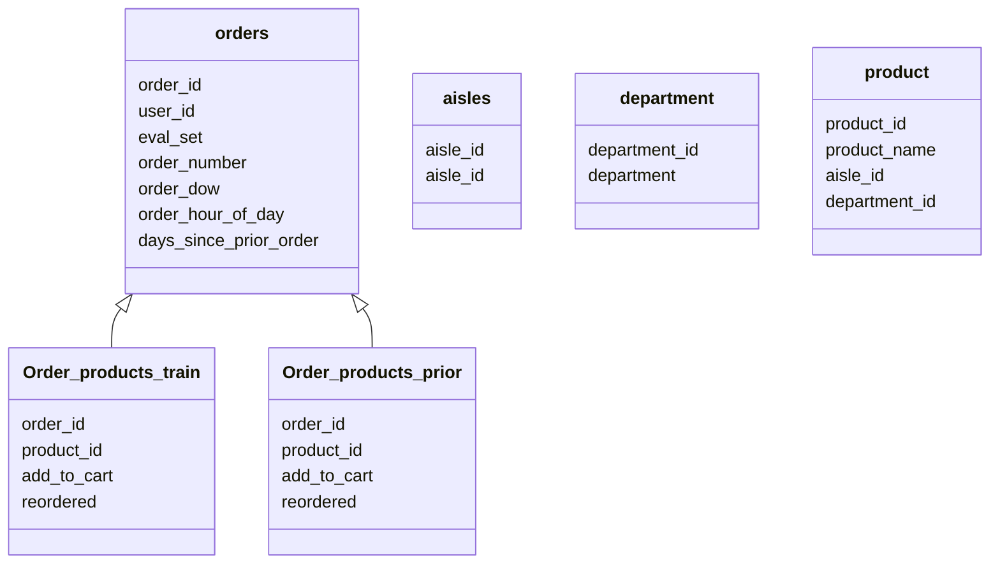

# Instacart Market Analysis 
## Problem Statement 
- Instacart Market Analysis aimed at predicting which products will the consumer reorder, which can be considered as the classification problem that given the `user id` and `product id`, whether the products will be reordered by the user. 

## Feature Engineering
### Dataset
- We are given 6 dataset for this assignment. `aisles.csv` is about the category of product placement; 'department.csv' is about the product type; `product.csv` is regarding the details info about products; `order.csv` describes details about order; `order_products_prior.csv` records the historical orders while `order_product_train.csv` records the orders in the training dataset. 

### EDA
- In this case, we performed EDA to explore the data for better understanding the data. By checking the shape of dataset, we got the idea of relationship between `order` dataset and `order_product_prior` and `order_product_train`. 
- In addition, we calculated average of reordered number and found that around 59% of customers had reorder behavior before. 
- We also calculate the number of total product categories and end with 21 categories in total. Since there are lots of categories, we temporarily going to skip the analyze on product type.
### Creating Features
We are considering two main factors in our feature engineering process:
- Factors regarding user feature, which refers to consumer habits that may influence their reorder behavior:
    - We calculated a number of metrics, including the number of orders for each user, shopping frequency (avg shopping period since last shopping), user product preference (count of the type of products made by each user), number of products purchased by a user in a period of time, shopping time preference (mode of user order in dow and hod), reorder situation (reorder mean by user), and user shopping frenzy (maximum number of items purchased by the user in all orders)

- Factors regarding product feature, which refers to the properties of products that may influence the reorder behavior of the consumer
    - Our product features include the popularity of the product (number of times the product has been purchased), the time period in which the product is being purchased most frequently, and the reorder mean of each product

## Experiment
### Data Split
- Because of memory issue, we selected only 5% of training data and testing data. In this case, since it is a  kaggle competition, which has no label in test data. We further splitted the training data into 70% training and 30% validation data. 
- There is a `eval_set` column in the `orders` dataset, which contains `prior`, `train`,and `test` while we also have a `order_product_prior` and `order_product_train` dataset. We are going to split the `orders` into three subset: `train_order_subset`, `prior_order_subset`. and `test_order_subset` first. Then joining `prior_order_subset` with `order_product_prior` and joining `train_order_subset` with `order_product_train` to get the complete `prior` and 'train` dataset. 
    - Basically, we extract the `user_id` and `product_id` from prior data. If the `user_id` as well as `product_id` in training data are not in the extracted ids, we label them as not reordered (label as 0), otherwise, we label it 1. 
- Next, since we have the `user_fea` and `product_fea` dataframe, we merged those features with the spliited data for training. 
- After the split, we checked the label distribution. The ratio between `label 0` and `label 1` is around 4:1, which is a bit imbalanced but acceptable.

### Model Architectures
- We chose three algorithms in this case: SVM, Random Forest, and LightGBM. The reason why we chose those models based on the complexity and nonlinear of consumer behavior. 
- SVM: We chose it as our benchmark model. We set the cost of 2 in this case considering the large scale of data. 
- Random Forest: Same concern as SVM, we reset the ntree to be 20, and mtry 4 to speed up the training.
- LightGBM: we chose it based on random forest, we used a boosting method and would like to improve speed at the same time.
### Result Analysis
- We compared these three models based on tree factors: run time, recall rate for reordered, and AUC.

| | SVM| Random Forest | LightGBM
| ---|---| ---| ---|
|Run time|4.71 mins| 2.71 secs | 0.26 secs 
|Recall rate for reorder|5.79%| 45.6% | 5.23% 
|AUC |0.7075| 0.8227 | 0.7386 
## Conclusion and Future Work
- Based on the comparison table, `Random Forest` outperforms based on its relatively high recall rate and satisfying run time. `LightGBM` performs best in terms of processing time.
- However, we picked only a subset of training data, which can be not typical. Therefore, in the next step, we should consider including the whole dataset in; furthermore, we haven't do a lot of trials of parameters in this case, we are going to try more combinations of parameters for better prediction.  

## Reference
- https://blog.csdn.net/MATLAB678/article/details/103685487
- https://blog.csdn.net/MATLAB678/article/details/103715379?spm=1001.2101.3001.6650.12&utm_medium=distribute.pc_relevant.none-task-blog-2%7Edefault%7EBlogCommendFromBaidu%7ERate-12.topblog&depth_1-utm_source=distribute.pc_relevant.none-task-blog-2%7Edefault%7EBlogCommendFromBaidu%7ERate-12.topblog&utm_relevant_index=15
- https://www.kaggle.com/code/cjansen/instacart-xgboost-starter-lb-0-3808482
- https://www.kaggle.com/code/arjunrampal/instacart-lightgbm-version-of-xgboost-starter
